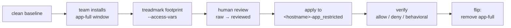

# declarative-access-profiles

**Least-privilege access for Linux application teams, derived from evidence
instead of guesswork.**

A team needs root to deploy their application — and three years later they
still have it, because nobody can say what they'd lose if you took it away.
This repo answers that question mechanically: diff the server against a
clean baseline after the install, and everything the install created — the
systemd units, timers, quadlets, directories, service accounts — *is* the
access surface the team actually needs. Capture it, review it, verify it,
publish it.

📖 **Read the full docs at
[mcowser-p.github.io/declarative-access-profiles](https://mcowser-p.github.io/declarative-access-profiles/)** —
including per-app guides for the team being locked down (`dev`) and the
team doing the locking (`ops`).

## How the pieces fit

| Project | Role |
| --- | --- |
| [treadmark](https://github.com/mcowser-p/treadmark) | Captures the install footprint on a build host and exports a first-draft access profile (`treadmark footprint --access-vars`) |
| **this repo** | The footprint evidence, the **human-reviewed** profiles, end-to-end verification, and the dev/ops documentation |
| [mcowser_p.declarative_access](https://github.com/mcowser-p/ansible-declarative-access) | The Ansible collection that applies (and revokes) a profile: scoped sudoers, ACLs, PAM group mapping, lingering |



The part that keeps this honest: **derived access is a first draft, never
an auto-grant.** Every profile here was reviewed by a human — the
byte-exact treadmark output (`*-raw.yml`) is committed next to the reviewed
version (`*-access.yml`), so **the diff between the two IS the review**.
Then each reviewed profile was applied, probed (allow *and* deny), and
revoked on a real KVM guest built from our holy-qcow golden images — the
CIS-hardened images the fleet actually runs, with SELinux (or AppArmor on
Ubuntu) and a real PAM stack. Every stamp names the exact image.

## Using a profile

Eleven applications × five distros (AlmaLinux 9/10, Ubuntu 24.04/26.04,
Amazon Linux 2023), all verified — see the [coverage
table](https://mcowser-p.github.io/declarative-access-profiles/). Apply one
with the collection:

```bash
ansible-galaxy collection install mcowser_p.declarative_access

ansible-playbook -i inventory playbooks/5_apply_access_profile.yml \
  -e @profiles/nginx/almalinux-9-access.yml \
  -e "group_name=<hostname>-app_restricted"
# revoke everything it granted: same command + --tags cleanup
```

The team ends up able to administer exactly the services, timers, and
folders their install created — nothing else — and the grant is fully
reversible.

## Where things live

| Path | What it is |
| --- | --- |
| `profiles/<app>/` | `<distro>-raw.yml` (byte-exact treadmark output, never edited) + `<distro>-access.yml` (reviewed) |
| `footprints/<distro>/` | The committed footprint JSON evidence each profile derives from |
| `docs/apps/<app>/` | `dev.md` (your life after lockdown) + `ops.md` (lockdown runbook) |
| `docs/role-evals/` | Public Ansible role evaluations (adopt / wrap / build) per app |
| `examples/<app>/` | Runnable worked examples: deploy via the adopted role with least-priv vars, then apply the reviewed profile |
| `docs/blog/` | [How it all fits together](docs/blog/how-it-fits-together.md) |
| `skills/evaluate-profile/` | The LLM skill that turns a fresh capture into this repo's artifact set |
| `matrix.yml` | The app × distro capture matrix (single source of truth) |
| `scripts/` | Batch capture + per-profile verification harnesses |

**The evidence promise:** untagged claims in the docs trace to a committed
footprint or profile in this repo. `[app-knowledge]` marks general software
facts we did not observe; `[needs-runtime-confirmation]` marks what
install-time capture cannot know.

## Regenerating or extending

The authoritative substrate is KVM: holy-qcow golden images (the same
CIS-hardened images the fleet runs) provisioned through the checkout's
`tofu/modules/vm`. The harnesses take their targets as environment
variables:

```bash
export ACCESS_SRC=/path/to/ansible-declarative-access   # the collection (verify)
export LIBVIRT_URI=qemu+ssh://user@kvm-host/system      # or local qemu:///system
export HOLY_QCOW_SRC=/path/to/holy-qcow                 # default: ../md

# authoritative: capture on holy-qcow KVM golden images (one VM per distro)
scripts/capture-matrix-kvm.sh --dry-run     # resolve images + preflight
scripts/capture-matrix-kvm.sh               # footprints + raw profiles, all distros
scripts/capture-matrix-kvm.sh sweep         # reap anything a failed run left behind

# authoritative: apply/probe/revoke every reviewed profile on real VMs
scripts/verify-profile-kvm.sh almalinux-9
scripts/verify-profile-kvm.sh --app nginx ubuntu-24.04

# treadmark installs on guests from PyPI (TREADMARK_VERSION, default 0.11.0);
# set TREADMARK_SRC=/path/to/checkout to test an unreleased build instead

# legacy AWS fallback (original three distros only; needs TREADMARK_SRC + creds)
scripts/capture-matrix-ec2.sh --dry-run
scripts/verify-profile-ec2.sh almalinux-9

# fast, low-fidelity local pre-check in containers (misses the OS auth
# surface: authselect, SELinux enforcing, real sshd/PAM)
scripts/capture-matrix.sh
scripts/verify-profile.sh nginx almalinux-9
```

`TREADMARK_SRC` must point at a treadmark tree whose `footprint` command
supports `--access-vars` (treadmark ≥ 0.11); the harness refuses to run
otherwise.

## License

Code (`scripts/`, `tools/`, `skills/`, CI) is Apache-2.0; documentation,
profiles, and footprints are CC BY 4.0. See [LICENSE.md](LICENSE.md) — and
the note there that profiles are reviewed evidence, not a security
guarantee for your environment.
