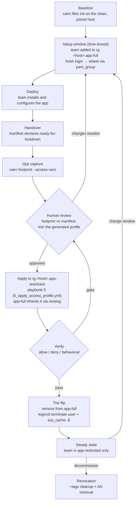

# Lifecycle: from setup window to restricted admin

This page is the canonical description of the deployment lifecycle every
profile in this repo assumes: how a team gets a time-boxed full-admin setup
window, how the install is captured as evidence, how a reviewed profile is
applied *without interrupting anyone*, and how the final "flip" leaves the
team able to administer exactly what they installed — nothing else. It also
covers change windows (re-elevation) and full revocation. App pages state
only their app-specific details and link here; the mechanics below apply to
every application. For what a profile actually grants once applied, see
[access-model.md](access-model.md).

## The two groups, and why nesting matters

Every managed host gets two per-host AD groups:

| Informal name | AD group | Access while a member |
|---|---|---|
| Setup admin | `<hostname>-app_full` | Full admin: mapped to `wheel` via pam_group, plus SSH |
| Restricted admin | `<hostname>-app_restricted` | SSH plus whatever the applied access profile grants |

`<hostname>-app_full` is **nested inside** `<hostname>-app_restricted` in AD.
That one design detail carries the whole lifecycle: anything granted to
app-restricted — sudoers entries, ACLs, the entire profile — is inherited by
app-full members through the nesting. So the profile is applied to
app-restricted *while the team still holds full admin through app-full*, and
applying it changes nothing they can feel. The eventual flip only removes
the `wheel` layer; the scoped access underneath was already live and
verified. There is no moment where a working setup window breaks and no
moment where the team has zero access.

## The pipeline

### Phase by phase

1. **Baseline.** Before the team touches the host, ops records the clean
   state: `cairn files init` on the deployed, AD-joined server. Everything
   the team does afterwards will be measured as a diff against this point,
   so the baseline must land *after* platform setup (join, access playbooks)
   and *before* team access — otherwise platform noise gets attributed to
   the team.

2. **Setup window.** The team is added to `<hostname>-app_full` and logs in
   fresh — pam_group grants `wheel` per session, at login, so an existing
   session gains nothing [app-knowledge]. The window is deliberately
   time-boxed: everything done in it is captured, and a short window keeps
   the capture (and the review that follows) readable.

3. **Deploy.** The team installs and configures the application with full
   admin. This is normal sysadmin work — packages, unit files, config, data
   directories, certificates (see [tls-ssl.md](tls-ssl.md) for where TLS
   material should live so the profile can cover it).

4. **Handover.** The team declares done: their deployment manifest states
   what they installed and what they need to keep operating. The doctrine
   for everything after this point: **the footprint is the truth; the
   manifest is your claim.** The manifest is what the team *says* they did;
   the footprint is what the host *records* they did. Review exists to
   reconcile the two — a claim with no footprint evidence doesn't go in the
   profile, and footprint entries the manifest never mentioned get
   questioned.

5. **Ops capture.** Ops runs
   `cairn footprint --app <app> --report footprint-<app>.json --access-vars <app>-access.yml`.
   The footprint JSON is the evidence record; the access-vars file is a
   *generated draft* profile derived from it.

6. **Human review.** The draft is committed and reviewed as a pull request —
   the PR is the approval record. Review means triaging the footprint's
   flagged risks and tightening the draft: strip write access to units that
   should be read-only, drop ownership entries, narrow sudo actions. A
   generated profile is a starting point, not a mandate; the review diff
   between raw capture and approved profile *is* the review. Exactly which
   files a given app's team needs to keep editing is knowable only from the
   real capture on the real host [needs-runtime-confirmation].

7. **Apply.** Playbook 5 (5_apply_access_profile.yml) from the
   `mcowser_p.declarative_access` collection applies the approved profile to
   `<hostname>-app_restricted`. Because app-full is nested inside
   app-restricted, the team inherits every grant immediately while still
   holding wheel — apply is a non-event for them, by design.

8. **Verify.** Three kinds of checks, in order of strength:
    - **Allow** — every operation the profile promises works
      (`sudo systemctl restart <unit>`, `sudo journalctl -u <unit>`, config
      edits via ACL).
    - **Deny** — operations outside the profile are refused
      (`sudo systemctl restart sshd`, writes to files not listed).
    - **Behavioral** — the application still actually works after a
      profile-scoped restart: the service comes up, serves, and logs
      (see [logging.md](logging.md) for what log access the profile
      typically carries and how to check it).

   Verification runs against a user who holds *only* app-restricted, so it
   proves the post-flip world before the flip happens.

9. **The flip.** Ops removes the team from `<hostname>-app_full`, then makes
   it real on the host: `loginctl terminate-user <user>` and
   `sss_cache -E`. Both are required. pam_group granted wheel at login, so
   removing the AD membership does nothing to sessions that are already
   open; and SSSD caches group membership, so a stale cache can re-grant
   wheel on the very next login [app-knowledge]. The flip only exists after
   sessions are terminated and the cache is flushed. The next login lands
   the user in app-restricted with the profile's grants and nothing more.

10. **Steady state.** The team administers exactly its own units, files,
    and folders. The baseline is refreshed (accept-all) so the approved
    state becomes the new reference point — the next capture will show only
    the next change, not history.

### Change windows

Application changes reuse the same machine. Ops re-adds the team to
`<hostname>-app_full` (time-boxed, again), the team makes its change, and the
capture → review → apply → verify → flip sequence runs again. Because the
baseline was refreshed at the last approved state, the new footprint shows
*only the delta* of this change window — the review stays small no matter
how many cycles the host has been through. Nothing about the team's existing
scoped access is interrupted at any point: they keep the old profile
throughout, gain wheel for the window, and end on the updated profile.

## Revocation

Offboarding or decommissioning runs playbook 5
(5_apply_access_profile.yml) with the same profile file and group, plus
`--tags cleanup`. This is a **full revocation** of everything the profile
granted:

- the sudoers file,
- the `group.conf` lines (the pam_group mapping),
- user lingering,
- and the granted ACLs — access ACLs on every listed file, recursive access
  **and default** ACLs on every listed folder.

Two deliberate exceptions, both worth understanding rather than being
surprised by:

- **Parent traverse ACLs remain.** Apply sets read+traverse (`rX`) entries
  on parent directories (for example `/etc/systemd/system`) so the entity
  can reach its granted paths. Those parent entries are shared by *every*
  profile the same entity holds, so cleanup of one profile cannot safely
  remove them. They grant traverse only. If the entity has no remaining
  profiles on the host, remove them manually
  (`setfacl -x g:<group> /parent/dir`).
- **Ownership is never reverted.** Ownership entries apply state
  (chown/chmod); cleanup has no record of the previous owners and will not
  guess. If ownership must be undone, re-chown deliberately.

AD membership and group removal are a separate, human step — cleanup
revokes what the host granted; AD controls who could have used it.

## Related concepts

- [access-model.md](access-model.md) — what an applied profile actually
  grants: scoped sudoers, ACLs, pam_group, and their limits
- [tls-ssl.md](tls-ssl.md) — certificate and key placement so TLS material
  survives the lockdown
- [logging.md](logging.md) — journal and file-log access under a profile,
  used heavily in the verify phase
