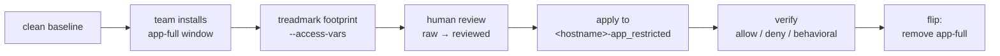

# Declarative Access Profiles

Evidence-based access profiles for Linux applications. Each application's
install was captured as a treadmark footprint in a clean container, the
generated `declarative_access` profile was **reviewed by a human** (the
raw→reviewed diff is committed), verified end to end — apply, allow/deny
probes, revoke — and published here with documentation for both sides of
the lockdown.

## Choose your door

- **"I deployed an app and got locked down"** → your app's **dev guide**
  (`apps/<app>/dev.md`) — everything you can still do, and how.
- **"I'm onboarding an app"** → the [ops onboarding
  workflow](onboarding.md) — the order of operations, gates, and decisions
  from provisioning to the flip.
- **"I'm locking a specific app down"** → its **ops runbook**
  (`apps/<app>/ops.md`) — evidence, review decisions, apply/verify/flip.
- **"How does an install become a profile?"** → [Footprints: how
  treadmark turns an install into evidence](concepts/footprints.md).
- **"I'm choosing an install role"** → the **role evaluations** —
  geerlingguy et al. scored against our requirements.
- **"I want the whole story"** → [How it fits
  together](blog/how-it-fits-together.md).

## The evidence promise

Untagged claims trace to a committed footprint or profile in this repo.
`[app-knowledge]` marks general software facts we did not observe;
`[needs-runtime-confirmation]` marks what install-time capture cannot
know. See [Conventions](conventions.md).

## Coverage

Generated by `tools/gen_coverage.py` from the filesystem — `captured`
(footprint + raw export) → `reviewed` (a human tightened it) →
**`verified`** (applied, probed, and revoked on a real EC2 instance).

<!-- coverage:start -->
| App | almalinux-9 | almalinux-10 | ubuntu-24.04 | Dev doc | Ops doc | Role eval |
| --- | --- | --- | --- | --- | --- | --- |
| nginx | **verified** | **verified** | **verified** | [dev](apps/nginx/dev.md) | [ops](apps/nginx/ops.md) | [eval](role-evals/nginx.md) |
| apache | **verified** | **verified** | **verified** | [dev](apps/apache/dev.md) | [ops](apps/apache/ops.md) | [eval](role-evals/apache.md) |
| haproxy | **verified** | **verified** | **verified** | [dev](apps/haproxy/dev.md) | [ops](apps/haproxy/ops.md) | [eval](role-evals/haproxy.md) |
| tomcat | **verified** | **verified** | **verified** | [dev](apps/tomcat/dev.md) | [ops](apps/tomcat/ops.md) | [eval](role-evals/tomcat.md) |
| php-fpm | **verified** | **verified** | **verified** | [dev](apps/php-fpm/dev.md) | [ops](apps/php-fpm/ops.md) | [eval](role-evals/php-fpm.md) |
| postgresql | **verified** | **verified** | **verified** | [dev](apps/postgresql/dev.md) | [ops](apps/postgresql/ops.md) | [eval](role-evals/postgresql.md) |
| mariadb | **verified** | **verified** | **verified** | [dev](apps/mariadb/dev.md) | [ops](apps/mariadb/ops.md) | [eval](role-evals/mariadb.md) |
| mysql | **verified** | N/A — mysql-server dropped from EL10 | N/A — deliberate wave-1 scope cut | [dev](apps/mysql/dev.md) | [ops](apps/mysql/ops.md) | [eval](role-evals/mysql.md) |
| redis | **verified** | **verified** | **verified** | [dev](apps/redis/dev.md) | [ops](apps/redis/ops.md) | [eval](role-evals/redis.md) |
| memcached | **verified** | **verified** | **verified** | [dev](apps/memcached/dev.md) | [ops](apps/memcached/ops.md) | [eval](role-evals/memcached.md) |
<!-- coverage:end -->

Every profile links its raw sibling; the diff between them is the review.
