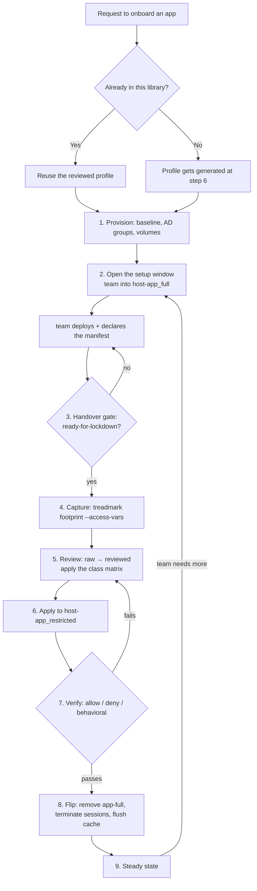

# Onboarding a Linux application — ops workflow

Your runbook for taking an application from "a team wants to run this" to
"the team has exactly the access their install justified, and nothing more."
[Lifecycle](concepts/lifecycle.md) explains the *mechanics* of the two AD
groups and the flip; this page is **your order of operations** — what you do,
what you require from the team before you'll proceed, and how you know each
step is finished.

Steps 1–5 are yours. Steps 3–4 are the team's work, listed because your gate
conditions depend on them; the team drives those from their own deploy
skills.

## The whole thing at a glance



## 0 — Triage the request

Check the [coverage table](index.md) first. If the app and distro are
already **verified**, you have a reviewed profile and both doc sets — you
skip the review work at step 5 and reuse them. If the app is listed but the
distro isn't, the review decisions still transfer; the
[distro map](https://github.com/mcowser-p/declarative-access-profiles/blob/main/skills/evaluate-profile/references/distro-map.md)
names what changes (package and unit names, service accounts, config
layouts, cert paths).

Also settle the install shape with the team now, because it changes what you
provision: a **distro package** (`dnf`/`apt`) for infrastructure software
you manage as packages, or **a container image run as a podman quadlet** for
anything they build. The container is the default; an OS package needs a
justification recorded in an ADR before installation.

## 1 — Provision the server

Four things, in this order:

1. **Take the clean treadmark baseline.** Everything downstream is a diff
   against it. No baseline, no footprint, no profile.
2. **Create the two AD groups** — `<hostname>-app_full` and
   `<hostname>-app_restricted`, with **full nested inside restricted**. That
   nesting is what lets you apply a profile later without interrupting a
   working setup window.
3. **Attach and mount any data volume** at the application's own data path.
   Do it now: mounting over a path after you've granted ACLs on it
   [hides those ACLs](concepts/storage.md#the-trap-a-mount-hides-the-acls-underneath-it)
   and the team silently loses access.
4. **Confirm the app's storage class** from the team's estimate — unbounded
   growth (any database) warrants its own volume.

## 2 — Open the setup window

Put the team into `<hostname>-app_full`. They hold admin (wheel via
pam_group) for the duration and deploy the application themselves.

Set the expectation in writing at this point: **anything requiring root must
happen inside this window.** After the flip they cannot install, mount,
chown, or edit anything outside their granted paths.

## 3 — The team deploys and declares *(their work, your gate)*

They install or run the app, configure it through drop-ins only, enable its
units, and record `config/deploy/manifest.yml`: exact unit names, service
accounts, config/data/log paths, linger users, and the storage block.

That manifest is their **claim**. You will diff the footprint against it —
which is why the handover doctrine is *the footprint is the truth; the
manifest is your claim*.

## 4 — Handover gate

Do not proceed until:

- `status: ready-for-lockdown` in the manifest;
- every unit is `is-enabled` **and** `is-active` (reboot-tested if the
  window allowed);
- drop-ins and quadlet files are mirrored in their repo;
- they've named the app for `--app` and given you the repo URL.

Sending it back at this gate is cheap. Discovering a missing unit after the
flip is not.

## 5 — Capture

```bash
sudo treadmark footprint --config /etc/treadmark/treadmark-footprint-linux.yaml \
  --app <app> --report footprint-<app>.json --access-vars <app>-access.yml
```

Exit code **1 means a footprint was found** — that's success, not failure.

Verify baseline provenance before you trust the output: the baseline must
predate the setup window. If it was created after the install started, the
capture is void — stop and escalate rather than improvising one.

For an app not yet in this library, this is where its profile is born: the
`evaluate-profile` skill turns the capture into reviewed per-distro profiles
plus the dev/ops doc pair.

## 6 — Review: the human gate

Derived access is a **first draft, never an auto-grant**. Cross-check the
raw export against the manifest — anything the profile grants that the team
never declared gets questioned before it gets granted, and anything declared
but missing from the footprint means it wasn't running at capture time.

The decision that shapes the profile is the **application class**:

| Class | pam_group | Content | Config | Logs |
| --- | --- | --- | --- | --- |
| Web server / proxy / app server | into the service group | setgid group-owned dir | write **ACL** | read ACL |
| **Database** | **none** — the service group owns the raw data | — | write ACL on **config only** | read ACL |
| Cache | usually none | — | write ACL on the config file | read ACL |

Never granted: the database data directory, in any list. Always dropped:
vendor unit-file write ACLs (root-equivalent for that unit) and
dependency-pulled units the team would never legitimately operate. Usually
added: the log directory, which footprints exclude by default — but verify
it exists, since some packages log only to journald.

Every difference from the raw export carries a
`REVIEW-DROP/KEEP/ADD/CHANGE` comment naming the reason. The committed diff
between `<distro>-raw.yml` and `<distro>-access.yml` **is** your review
record, and the next reviewer reads it.

## 7 — Apply

```bash
ansible-playbook -i inventory playbooks/5_apply_access_profile.yml \
  -e @profiles/<app>/<distro>-access.yml \
  -e "group_name=<hostname>-app_restricted" -l <host>
```

Safe to run while the team is working: group nesting means they inherit the
scoped grants immediately and lose nothing. Eyeball the artifacts
afterwards — the sudoers file (`visudo -cf` it), the `group.conf` line, and
`getfacl` on each granted path.

## 8 — Verify, before the flip

Three probe sets, all required:

- **Allow** — every granted verb against the real units, a config write, a
  log read.
- **Deny** — `systemctl restart sshd`, a package install, a vendor unit-file
  edit.
- **Behavioral** — a **fresh** SSH login shows the mapped service group in
  `id`, and a write only that group permits succeeds.

A stale session is a false negative: pam_group membership is granted at
login. A failure here returns you to step 6 — that loop is doing its job,
and it's how a grant for a `/var/log` directory that doesn't exist on Debian
got caught before it reached a real server.

## 9 — Flip

Order matters:

1. Refresh the treadmark baseline — **only after** the footprint and reviewed
   profile are committed, since `--accept-all` erases the forensic diff.
2. In AD: remove the team from `app-full`, add them directly to
   `app-restricted`.
3. On the host: `loginctl terminate-user <user>` for each of them, then
   `sss_cache -E`. Admin ends at that moment, not at their next logout.
4. Confirm on a fresh login: no wheel in `id`, `sudo -l` shows only the
   profile.

Tell the team their first command next login is `sudo -l`.

## 10 — Steady state and change windows

The team operates from their dev guide. When they need something outside the
grant, reopen a **change window**: re-add them to `app-full`, let them work,
require an updated manifest, and repeat from step 4. Re-run the apply after
any package upgrade or mount change — it's idempotent, and upgrades shed
file ACLs.

Revocation at project end is the same apply command plus `--tags cleanup`:
sudoers, group.conf entries, lingering, and ACLs all go. Ownership is never
reverted, and parent traverse ACLs stay (they're shared).

## Gate checklist

| # | Step | Gate — do not proceed until |
| --- | --- | --- |
| 1 | Provision | Clean baseline taken; both AD groups exist and are nested; volumes mounted |
| 2 | Setup window | Team in `app-full` and told that root work happens now or never |
| 3–4 | Handover | `ready-for-lockdown`; units enabled and active; manifest complete |
| 5 | Capture | Footprint exits 1; baseline predates the install |
| 6 | Review | Every delta carries a REVIEW-* reason; class matrix applied; data dir never granted |
| 7 | Apply | Sudoers valid, ACLs and `group.conf` present on the host |
| 8 | Verify | Allow, deny, **and** behavioral probes all pass |
| 9 | Flip | Fresh login shows no wheel; `sudo -l` scoped to the profile |
